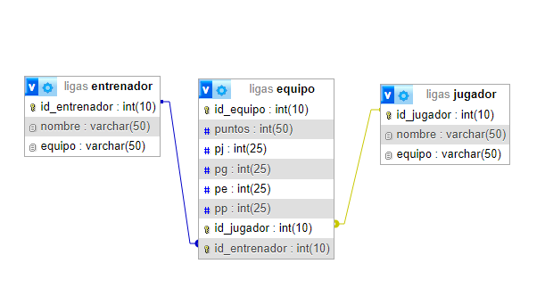

En este diagrama lo que hicimos fue relacionar las tablas entrenador y jugadores con la principal que seria equipos, cada jugador y entrenador con su respectivo equipo.
Y despues estarian los partidos jugados , ganados, perdidos ,etc.

